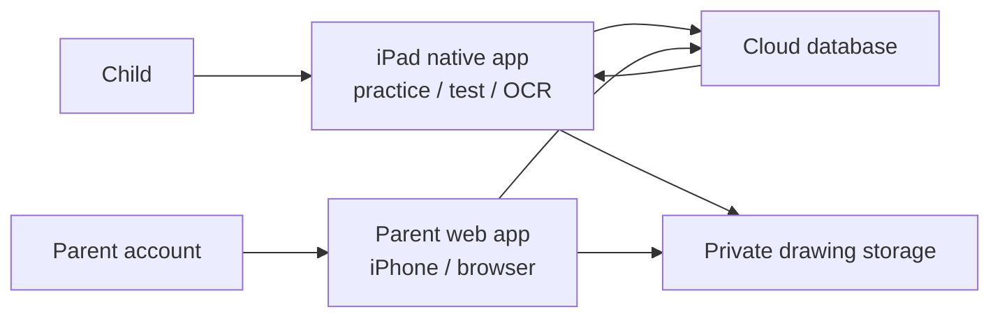
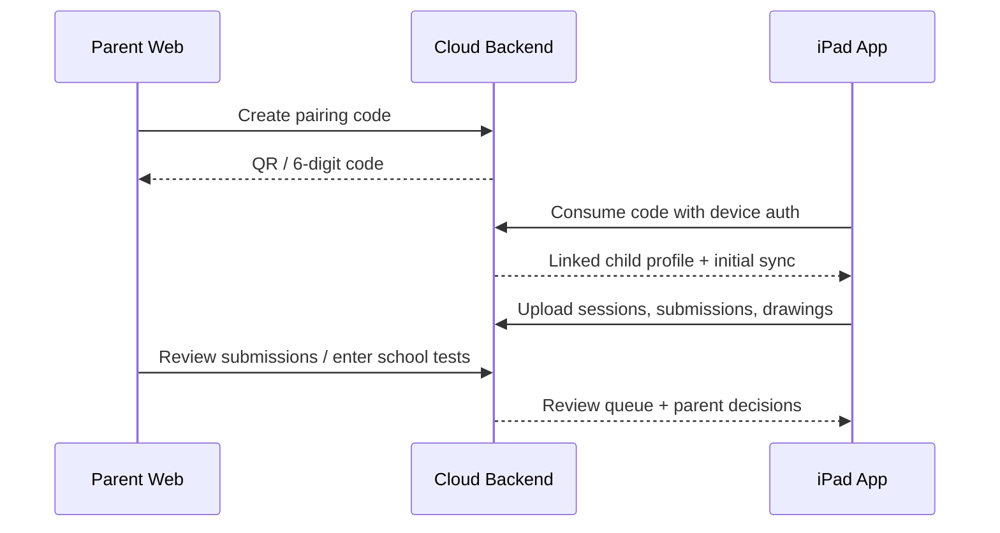

# Parent Web and Cloud Sync Design

> **⚠️ SUPERSEDED (2026-06-25):** この Supabase + 親Web 路線は採用されなかった。
> 運用ゼロ・子データ非保持を最優先する判断により、**CloudKit + ネイティブ親iPhoneアプリ**路線へ移行した。
> 現行設計は `docs/multi-user-cloudkit-sync-design.md` を参照。
> 本書は将来 Android/世界展開を本格化する際の参照資料として残置する。

Status: Design only. No implementation in this document. **(Superseded — see banner above.)**
Date: 2026-06-07

## 1. Recommendation

Use this product split:

- Child experience: keep the iPad app native.
- Parent experience: build a mobile-first web app first.
- Shared data: move learning records, grading, school test records, word steps, and review queues into a cloud backend.

Recommended backend: Supabase.

Why:

- The app data is relational: family, child, step, word, session, submission, parent review, school test, review queue.
- Parent access control should be row-based by family and child.
- Web and iOS can share the same Auth, Postgres database, Storage, and server functions.
- The parent web app can ship and iterate faster than a separate iPhone app.

Do not make the parent iPhone app first. The parent flow is mostly review, grading, and data entry. A responsive web app is enough to validate the UX, and it avoids App Store review cycles for every parent-side change.

Do not move the child's handwritten learning experience to web. Apple Pencil writing and PencilKit capture remain better suited to native iPad.

### Technology Decision

| Option | Fit | Decision |
| --- | --- | --- |
| Supabase | Strong for relational data, Auth, Postgres, Storage, row-level access, web + iOS clients | Recommended |
| Firebase | Strong for PWA/mobile, realtime sync, Auth, Storage; less natural for relational step/session/report queries | Acceptable fallback |
| Apple CloudKit | Good for Apple-only apps; weaker fit for parent web, non-Apple browser access, and product portability | Not recommended for this parent-web goal |

Parent web stack recommendation:

- Next.js or another React-based PWA.
- Supabase Auth for parent login.
- Supabase Postgres for relational records.
- Supabase Storage for drawings and thumbnails.
- Server functions only for transactional operations such as pairing, school-test upsert, and review queue updates.

## 2. Product Boundaries

### iPad App

Owns:

- Handwriting practice.
- App test mode.
- OCR and immediate feedback.
- Child motivation UI.
- Local-first learning flow when offline.
- Uploading completed sessions and drawings.
- Pulling parent grading results and review assignments.

Does not own:

- Parent login.
- Parent account management.
- Long-term reporting UI.
- School test history management beyond local display, if needed.

### Parent Web App

Owns:

- Parent login.
- Pairing an iPad/child profile.
- Word step creation and editing.
- Importing word lists from text or camera OCR.
- Reviewing handwriting submissions.
- Approving or marking items for review.
- Entering school test results.
- Viewing step-level progress.
- Managing review carry-over.

### Cloud Backend

Owns:

- Source of truth after pairing.
- Family and child access control.
- Sync state.
- Drawing storage and signed access.
- Review queue generation.
- School test upsert behavior.

## 3. Core UX Principle

The parent web app should not feel like a generic admin dashboard.

The first screen should answer:

1. What needs my action now?
2. Is this step ready for the school test?
3. Did the school test reveal words to review?

The child iPad app should not expose account complexity. The child only sees:

- Current step.
- Review words when assigned.
- Practice/test actions.
- Simple sync status if needed.

## 4. Account and Pairing Design

### Parent Account

Parent signs in on the web app using:

- Email magic link as the recommended MVP option.
- Apple/Google sign-in as later additions.

Reason: magic link avoids password UX and works well on iPhone browsers.

### Family

One parent account creates one family automatically on first login.

A family can have:

- Multiple parent members.
- Multiple child profiles.
- Multiple linked iPads.

### Child Profile

The child does not need a login account.

Child profile fields:

- Display name.
- Grade/year group, optional.
- Language preference.
- Active step.
- Reward state.

### iPad Pairing

Recommended flow:

1. Parent opens web app and signs in.
2. Parent chooses "iPadをつなぐ".
3. Web app shows a six-digit pairing code and QR code.
4. iPad app opens "保護者とつなぐ".
5. Parent or child scans QR code, or enters the six-digit code.
6. Backend validates the code and links the iPad device to the selected child profile.
7. Existing local iPad data is uploaded to the child profile.

Pairing code rules:

- Expires after 15 minutes.
- Single use.
- Scoped to one family and optionally one child profile.
- Does not expose parent credentials to the iPad.

iPad authentication rule:

- The child still has no login.
- The iPad app uses an install-scoped anonymous/device auth identity.
- After pairing, that auth identity is linked to `child_devices`.
- Row-level policies allow that device identity to sync only its linked child profile.
- If the device is revoked by the parent, the device can no longer read or write cloud data.

## 5. System Flow





## 6. Data Model

Use UUID primary keys for all cloud records. The iPad can create UUIDs offline and sync later.

### families

| Column | Type | Notes |
| --- | --- | --- |
| id | uuid | Primary key |
| name | text | Optional |
| created_at | timestamptz | Server time |

### family_members

| Column | Type | Notes |
| --- | --- | --- |
| id | uuid | Primary key |
| family_id | uuid | families.id |
| user_id | uuid | auth user id |
| role | text | owner, parent |
| created_at | timestamptz | Server time |

Rule: every parent query is restricted to families where the auth user is a member.

### child_profiles

| Column | Type | Notes |
| --- | --- | --- |
| id | uuid | Primary key |
| family_id | uuid | families.id |
| display_name | text | Child-facing name |
| app_language | text | japanese, english |
| active_word_step_id | uuid | Nullable |
| created_at | timestamptz | Server time |
| archived_at | timestamptz | Nullable |

### child_devices

| Column | Type | Notes |
| --- | --- | --- |
| id | uuid | Primary key |
| family_id | uuid | families.id |
| child_id | uuid | child_profiles.id |
| device_name | text | iPad name if available |
| device_public_id | text | Non-secret stable app install id |
| auth_user_id | uuid | Anonymous/device auth user id |
| trusted_at | timestamptz | When pairing completed |
| revoked_at | timestamptz | Nullable |

### pairing_codes

| Column | Type | Notes |
| --- | --- | --- |
| id | uuid | Primary key |
| family_id | uuid | families.id |
| child_id | uuid | Nullable until selected |
| code_hash | text | Store hash, not raw code |
| expires_at | timestamptz | 15 minutes after creation |
| consumed_at | timestamptz | Nullable |
| created_by | uuid | Parent auth user id |

### word_steps

| Column | Type | Notes |
| --- | --- | --- |
| id | uuid | Primary key |
| family_id | uuid | families.id |
| child_id | uuid | child_profiles.id |
| step_number | int | Display number, stable within child |
| title | text | Default: "ステップ N" |
| registered_date | date | Japanese date display in Japanese UI |
| source | text | manual, camera_ocr, text_import, migration |
| sort_order | int | Avoid relying only on dates |
| created_at | timestamptz | Server time |
| updated_at | timestamptz | Server time |
| archived_at | timestamptz | Nullable |

Rules:

- Step number is child-local and never reused after deletion; archived steps remain hidden but preserve history.
- Creating a new step selects it for the child by default.
- Editing words later is allowed from the parent web app.

### spelling_words

| Column | Type | Notes |
| --- | --- | --- |
| id | uuid | Primary key |
| family_id | uuid | families.id |
| child_id | uuid | child_profiles.id |
| step_id | uuid | word_steps.id |
| text | text | Normalized English word |
| prompt_text | text | Japanese meaning or hint; furigana markup allowed |
| display_order | int | Word order inside step |
| created_at | timestamptz | Server time |
| updated_at | timestamptz | Server time |
| archived_at | timestamptz | Nullable |

Rules:

- `text` stores lowercase normalized letters only for spelling comparison.
- `prompt_text` can store markup like `友[とも]だち` until a richer furigana model is needed.
- Word uniqueness is enforced per child + step + normalized text among active words.

### study_sessions

This replaces the current implicit session grouping by `sessionID`.

| Column | Type | Notes |
| --- | --- | --- |
| id | uuid | Primary key |
| family_id | uuid | families.id |
| child_id | uuid | child_profiles.id |
| step_id | uuid | Main step |
| mode | text | practice, app_test, review |
| status | text | in_progress, completed, abandoned |
| started_at | timestamptz | Client time plus server receipt |
| completed_at | timestamptz | Nullable |
| app_version | text | iPad app version |
| device_id | uuid | child_devices.id |
| word_count | int | Planned word count |
| completed_word_count | int | Completed count |

Rules:

- Practice, app test, and review are all sessions.
- Parent grading screen groups by session first, not by loose card list.
- Abandoned sessions are not shown as main grading work unless they contain submissions.

### study_submissions

This replaces separate parent-facing handling for `SpellingAttempt` and `PracticeSample`.

| Column | Type | Notes |
| --- | --- | --- |
| id | uuid | Primary key |
| family_id | uuid | families.id |
| child_id | uuid | child_profiles.id |
| session_id | uuid | study_sessions.id |
| step_id | uuid | word_steps.id |
| word_id | uuid | spelling_words.id, nullable for migrated orphan |
| expected_word | text | Snapshot at time of answer |
| mode | text | practice, app_test, review |
| repetition_index | int | 1, 2, 3 for practice |
| question_index | int | Order in session |
| recognized_text | text | OCR result |
| ocr_confidence | float | Nullable |
| auto_decision | text | auto_correct, auto_incorrect, needs_review, rewrite, time_expired, skipped |
| parent_decision | text | unreviewed, approved, needs_practice |
| drawing_storage_path | text | Private storage path |
| thumbnail_storage_path | text | Private storage path |
| submitted_at | timestamptz | Client time |
| parent_reviewed_at | timestamptz | Nullable |
| parent_reviewed_by | uuid | Nullable auth user id |

Rules:

- App test submissions with `skipped` or missing drawing do not count as correct.
- Low OCR confidence can still be auto-correct if normalized OCR matches the expected word.
- Parent decision overrides auto decision for progress.
- Practice samples are reviewable but do not count as app test correctness.
- Drawings are append-only. Parent example drawings are separate artifacts.

### parent_example_drawings

| Column | Type | Notes |
| --- | --- | --- |
| id | uuid | Primary key |
| family_id | uuid | families.id |
| child_id | uuid | child_profiles.id |
| submission_id | uuid | study_submissions.id |
| storage_path | text | Parent-written example |
| thumbnail_storage_path | text | Preview |
| created_by | uuid | Parent auth user id |
| created_at | timestamptz | Server time |

### school_tests

| Column | Type | Notes |
| --- | --- | --- |
| id | uuid | Primary key |
| family_id | uuid | families.id |
| child_id | uuid | child_profiles.id |
| step_id | uuid | word_steps.id |
| test_date | date | School test date |
| score | int | Number correct |
| total | int | Number of target words |
| note | text | Optional |
| created_by | uuid | Parent auth user id |
| created_at | timestamptz | Server time |
| updated_at | timestamptz | Server time |

Rules:

- Same child + step + test_date is one slot.
- Entering another school result for the same date overwrites the existing slot.
- Default state in UI is all words correct; parent taps only missed words.

### school_test_items

| Column | Type | Notes |
| --- | --- | --- |
| id | uuid | Primary key |
| school_test_id | uuid | school_tests.id |
| word_id | uuid | spelling_words.id |
| expected_word | text | Snapshot |
| result | text | correct, missed |

Rules:

- Missed words generate or reopen review queue items.
- Correct words can clear school-sourced review items if the same word was previously missed and not missed again.

### review_queue_items

| Column | Type | Notes |
| --- | --- | --- |
| id | uuid | Primary key |
| family_id | uuid | families.id |
| child_id | uuid | child_profiles.id |
| word_id | uuid | spelling_words.id |
| source_step_id | uuid | Original step |
| source_type | text | app_test, school_test, parent_review, manual |
| source_id | uuid | Related submission or school test |
| status | text | open, assigned, cleared, dismissed |
| reason | text | missed, parent_marked, school_missed |
| created_at | timestamptz | Server time |
| assigned_at | timestamptz | Nullable |
| cleared_at | timestamptz | Nullable |

Rules:

- Review words from the previous step are automatically included in the next step's app test set.
- On the home screen, review words are labeled as review, not normal step words.
- A word is cleared when the child completes an app test submission that is approved or auto-correct and is newer than the queue source.

### reward_wallets

| Column | Type | Notes |
| --- | --- | --- |
| child_id | uuid | Primary key |
| family_id | uuid | families.id |
| coins | int | Current coin balance |
| updated_at | timestamptz | Server time |

### reward_transactions

| Column | Type | Notes |
| --- | --- | --- |
| id | uuid | Primary key |
| child_id | uuid | child_profiles.id |
| amount | int | Positive or negative |
| reason | text | practice_completed, unlock_character, migration_adjustment |
| source_id | uuid | Optional session/unlock id |
| created_at | timestamptz | Server time |

### character_unlocks

| Column | Type | Notes |
| --- | --- | --- |
| id | uuid | Primary key |
| child_id | uuid | child_profiles.id |
| character_id | text | Catalog id |
| unlocked_at | timestamptz | Server time |

### child_settings

| Column | Type | Notes |
| --- | --- | --- |
| child_id | uuid | Primary key |
| app_language | text | japanese, english |
| speech_language | text | en-US |
| test_prompt_mode | text | audio_only, text_only, audio_and_text |
| speech_rate | float | Current default |
| seconds_per_word | int | Current default |
| max_replays | int | Current default |
| practice_repetitions | int | Current default |
| updated_at | timestamptz | Server time |

## 7. Derived State Rules

### App Test Correctness

An app test word counts as correct only if:

- The latest submission for that word in the relevant session has `parent_decision = approved`, or
- `parent_decision = unreviewed` and `auto_decision = auto_correct`.

It does not count as correct if:

- The child skipped it.
- No drawing was submitted.
- OCR was blank and no parent approval exists.
- Parent marked it as needs practice.

This fixes the current ambiguity where `1/4` can look like correctness even when other words were skipped.

### Practice Completion

Practice completion means:

- The child wrote each selected word the configured number of repetitions.
- Each repetition has non-empty drawing data.

Practice completion does not force the child into a test. The completion screen should offer:

- "テストしてみる" as the most prominent action.
- "もう一度れんしゅう" with word selection.
- "ホーム" as a secondary action.

### Review Carry-Over

If a school test for Step 1 is entered while the child is currently studying Step 2:

1. The Step 1 school missed words become open review queue items.
2. The child remains on Step 2.
3. Home shows Step 2 plus a clearly labeled review count.
4. The next app test set includes Step 2 words plus open review words from Step 1.
5. Once the child passes those review words, the queue items are cleared.

The active step should not jump back to Step 1 automatically.

## 8. Parent Web UX

### Navigation

Use four top-level areas:

1. 今日やること
2. 採点
3. ステップ
4. 設定

Avoid separate menu items for every data type. Parents should not have to choose between "アプリのテスト結果", "学校テスト", "手書き一覧", and "学習履歴" before knowing what they need.

### 今日やること

Primary cards:

- 採点待ち: number of sessions that need parent review.
- 学校テスト入力: if a step likely needs a school result.
- 復習あり: number of open review words.
- 今のステップ: active step and readiness.

Primary action is always the most urgent one:

- If ungraded submissions exist: "採点する".
- Else if school test result is missing for a completed step: "学校テストを入れる".
- Else if review queue exists: "復習を確認".
- Else: "ステップを見る".

### 採点

Show sessions first, not individual cards in a long row.

Session card fields:

- Mode icon: practice, app test, review.
- Step number.
- Time.
- Count: ungraded / total.
- One clear button: "見る".

Inside a session:

- Show one word at a time by default.
- Drawing preview is large.
- Expected word is clear.
- OCR result is secondary.
- Actions are large and fixed:
  - OK
  - 復習に入れる
  - お手本を書く

After pressing OK or review:

- Animate a small confirmation.
- Move to next ungraded item.
- Do not silently change content with no feedback.

### ステップ

Step list should scale to hundreds of steps.

Use:

- Search by step number or date.
- Latest steps first.
- Compact rows, not large cards for every step.
- Active step pinned at the top.

Step detail shows three sections:

1. いまの状態
   - Ready / needs review / school test missing.
2. アプリの結果
   - Recent app test sessions and pass state.
3. 学校テスト
   - Date chips and result summary.

Avoid repeating "ステップ 1" in every nested area. Use it once as the page title.

### 学校テスト入力

Recommended UI:

- Date picker using Japanese date format in Japanese UI.
- Word checklist defaults to all correct.
- Parent taps missed words only.
- Score is calculated automatically, e.g. `3/4 正解`.
- Same date + same step updates existing result instead of adding a duplicate.
- Save button text: "この結果を保存".
- Delete requires confirmation.

### Word Step Management

Parent can:

- Create a new step.
- Edit words in an existing step.
- Import from pasted text.
- Import from camera OCR, then manually fix.

Camera OCR should be positioned as "rough import", not perfect recognition.

### iPhone Web Behavior

Design mobile-first:

- Card layout instead of wide tables.
- Large tap targets.
- Predictable browser back behavior.
- Avoid horizontal scrolling except for controlled chips.
- Avoid pull-to-refresh on grading forms.

## 9. iPad UX Changes Needed Later

No implementation now, but the cloud design implies these future iPad changes:

- Add pairing screen.
- Add small sync status only in parent/settings area.
- Replace local-only word source with synced steps after pairing.
- Keep local-first session writing even when offline.
- Upload drawings in background after session completion.
- Pull parent review queue and show review labels clearly.
- Pull parent example drawings and show them in review/practice where appropriate.

## 10. Sync Design

### Local-First

The iPad should continue to work offline.

Local records:

- Words/steps cache.
- Current active step.
- In-progress practice state.
- Completed sessions.
- Pending uploads.
- Pending reward transactions.

### Upload Strategy

For each completed session:

1. Create or upsert `study_sessions`.
2. Upload PKDrawing data and thumbnail images to private storage.
3. Create `study_submissions`.
4. Mark local sync state as uploaded.

Drawings:

- Store original `PKDrawing.dataRepresentation()` for native replay.
- Store PNG thumbnail for web preview.
- Web app reads thumbnails by default and downloads full drawing only when needed.

### Conflict Rules

- Sessions and submissions are append-only from iPad.
- Parent decisions can update submissions.
- Word step edits from parent are server source of truth.
- If iPad has unsynced sessions for a word that parent later edits, submissions keep `expected_word` snapshot and nullable `word_id` if needed.
- School test result same child + step + date is upsert/overwrite.

### Sync Status Values

Local sync state for iPad:

- pending_upload
- uploading
- synced
- failed_retryable
- failed_needs_parent

The child should rarely see these. Parent/settings can show diagnostics.

## 11. Security and Privacy

### Authorization

Use row-level access:

- Parent can read/write only records in their family.
- Parent can access only child profiles in their family.
- iPad device can sync only the linked child profile.
- Storage paths are private and scoped by family/child.

Storage path pattern:

```text
families/{family_id}/children/{child_id}/submissions/{submission_id}/drawing.data
families/{family_id}/children/{child_id}/submissions/{submission_id}/thumb.png
families/{family_id}/children/{child_id}/parent_examples/{example_id}/drawing.data
```

Use signed URLs for parent web image display.

### Row-Level Policy Shape

Parent access:

- Allow read/write when `auth.uid()` is present in `family_members` for the row's `family_id`.

iPad device access:

- Allow read/write when `auth.uid()` is present in `child_devices.auth_user_id`.
- Device access must also match the row's `family_id` and `child_id`.
- Revoked devices cannot access data.

Storage access:

- Parent signed URLs are generated only after family membership is checked.
- Device uploads are accepted only into the linked child's storage prefix.

Server functions:

- Pairing and school-test upsert should run server-side because they must validate multiple records in one transaction.

### Child Privacy

Avoid collecting:

- Child email.
- Child phone.
- Precise school name unless explicitly needed.
- Voice recordings.

Store only:

- Display name or nickname.
- Learning content.
- Handwriting drawings.
- Test and practice history.

If this becomes a public product in the United States, COPPA review is required because it handles data connected to children under 13.

## 12. Migration From Current Local Data

Current local data:

- `SpellingWord`
- `SpellingAttempt`
- `PracticeSample`
- `SchoolTestResult`
- `TestSettings`
- selected step
- coins and character unlocks
- home review word IDs

Migration after pairing:

1. Create family/child if not already created.
2. Convert current date-grouped local steps to `word_steps`.
3. Convert `SpellingWord` to `spelling_words`.
4. Convert each unique local `sessionID` into one `study_sessions` row.
5. Convert `SpellingAttempt` to `study_submissions` with `mode = app_test`.
6. Convert `PracticeSample` to `study_submissions` with `mode = practice` or `review`.
7. Upload drawing data and thumbnails.
8. Convert `SchoolTestResult` to `school_tests` and `school_test_items`.
9. Convert `homeReviewWordIDs` to open `review_queue_items`.
10. Convert reward state to `reward_wallets` and `character_unlocks`.

Preserve local UUIDs as cloud UUIDs where possible.

## 13. Backend API Surface

Most CRUD can use Supabase client SDK with RLS. Use server functions for operations that need validation or transactions.

Recommended server functions:

- `create_pairing_code(child_id)`
- `consume_pairing_code(code, device_public_id)`
- `create_or_update_school_test(step_id, test_date, missed_word_ids, note)`
- `mark_submission_reviewed(submission_id, decision, parent_example_upload_id?)`
- `assign_review_words_to_home(word_ids)`
- `complete_review_item(word_id, source_id?)`
- `sync_child_snapshot(since_cursor)`

Storage:

- iPad uploads drawing and thumbnail.
- Parent web fetches signed thumbnail URL.
- Parent example drawings use the same storage pattern.

## 14. Implementation Phases

### Phase 1: Cloud Foundation

Deliverables:

- Supabase project.
- Database schema.
- RLS policies.
- Private storage buckets.
- Pairing functions.
- Migration plan tested with local fixture data.

No UI changes beyond a hidden/debug pairing path.

### Phase 2: iPad Sync MVP

Deliverables:

- Pair iPad to child profile.
- Upload completed practice/test sessions.
- Pull word steps and settings.
- Pull review queue.
- Keep offline local behavior.

### Phase 3: Parent Web MVP

Deliverables:

- Parent login.
- Pairing page.
- Today page.
- Grading by session.
- Step list/detail.
- School test input.
- Word step create/edit/import.

### Phase 4: Product Polish

Deliverables:

- Notifications or reminders.
- Better camera import flow.
- Parent example drawing editor improvements.
- Analytics summaries.
- Multi-child support polish.
- Optional native parent iPhone app if the web UX proves insufficient.

## 15. Acceptance Criteria

The design is considered implemented correctly when:

- Parent can sign in on iPhone Safari and pair an iPad.
- iPad can continue learning offline and sync later.
- Parent can see practice and test sessions grouped by session.
- Parent can grade handwriting with OK or review-needed.
- Parent can write an example for a submission.
- Parent can enter a school test by selecting missed words only.
- Same-day same-step school test entry overwrites instead of duplicating.
- Missed school words automatically appear as review in the child's later study flow.
- App test skipped words never count as correct.
- Hundreds of steps remain navigable through search/list, not large repeated cards.
- A parent cannot access another family's data.
- A revoked iPad cannot sync the child profile.

## 16. Deferred Decisions

These should not block design approval:

- Whether parent login starts with magic link only or also includes Apple/Google at MVP.
- Whether parent web is hosted on Vercel, Supabase, or another host.
- Exact retention period for old drawings.
- Whether notifications are email-only at first or push-capable later.

Recommended defaults:

- Magic link only for MVP.
- Next.js PWA hosted on Vercel or equivalent.
- Retain drawings unless parent deletes the child profile.
- No notifications until parent web + sync are stable.

## 17. External References

- Apple PencilKit: https://developer.apple.com/documentation/pencilkit
- Supabase Auth and RLS integration: https://supabase.com/docs/guides/auth
- Firebase PWA reference, useful as an alternative if Firebase is chosen: https://firebase.google.com/docs/web/pwa
- FTC COPPA rule overview: https://www.ftc.gov/legal-library/browse/rules/childrens-online-privacy-protection-rule-coppa
